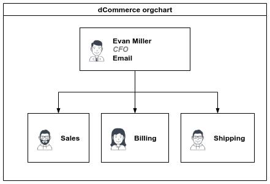
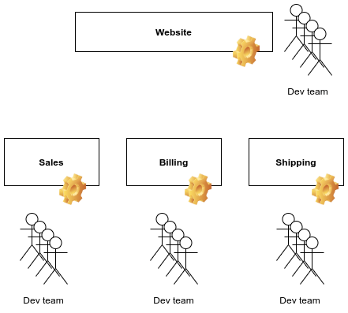
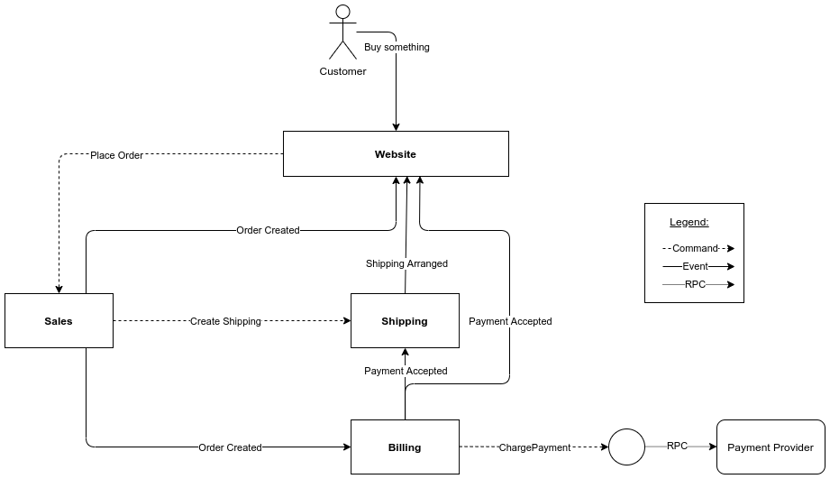
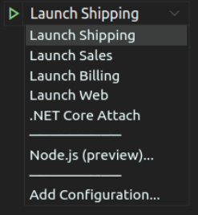
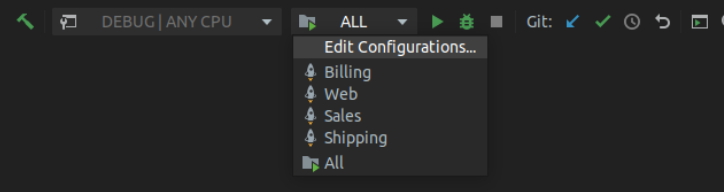

# dCommerce

## Introduction

This repository contains a solution for an eCommerce business called `dCommerce`. The uniqueness of the system lies in its distribution. 

This project aims to show the benefits and drawbacks of a distributed system.

## Background

Let's take a look at the organization chart of the company.



According to [the Conway's Law](https://en.wikipedia.org/wiki/Conway%27s_law):

> "Any organization that designs a system (defined broadly) will produce a design whose structure is a copy of the organization's communication structure."

This statement has a reflection in the development teams structure which presents the picture below:



Each department has it's own development team which builds part of the system. To ensure the non-functional requirements like scalability, reliability and last but not least, parallel development, the solution architect decided to design `a distributed system`.

This repository contains code which covers order placing feature. A user can track the status of his/her order. Going through the process order meets statuses:
- Placed
- Created
- Payment accepted
- Payment rejected (as a rainy day scenario not covered yet.)
- Shipping arranged

For a better understanding of what happens when a customer place an order, below is the flow chart with communication between context details.



To speed up the development process, the MassTransit framework is used. The transport layer is covered by the RabbitMQ message broker. For monitoring purposes, I get the advantage of Jaeger.

## Running the project

### Requirements
- [.Net Core SDK 3.1](https://dotnet.microsoft.com/download)
- [docker](https://www.docker.com/get-started)
- [docker-compose](https://docs.docker.com/compose/install/)

### Running the infrastructure

To run the project's infrastructure type in your command line

```
docker-compose up
```

### Running projects

I prepared the dedicated tasks for VS Code and Rider's IDEs.

VS Code



Rider



Start the selected project. If you're using Rider, you could lunch all projects at once.


## Patterns used in project

- Events
- Commands
- Retry policies
- Outbox pattern

## Technologies

This project uses technologies and frameworks:
- .Net Core 3.1
- [Blazor](https://docs.microsoft.com/en-us/aspnet/core/blazor/?view=aspnetcore-3.1)
- [Entity Framework](https://docs.microsoft.com/en-us/ef/)
- [MassTransit](https://masstransit-project.com/)
- [docker](https://www.docker.com/)
- [PostgreSQL](https://www.postgresql.org/)
- [Jaeger](https://www.jaegertracing.io/)
- [RabbitMQ](https://www.rabbitmq.com/)